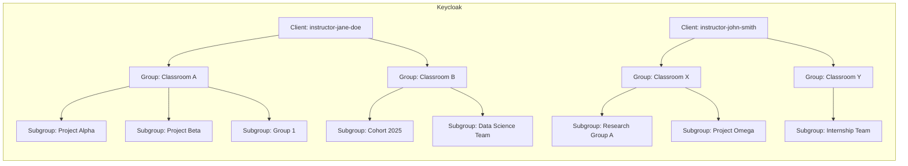

# Using Keycloak for CKAN Access Control in the National Data Platform (NDP)

## Overview
This document explains why Keycloak is a preferred choice for managing data access in CKAN and outlines how its **client**, **group**, and **subgroup** structure can be effectively leveraged in the **National Data Platform (NDP)** for managing **classrooms**, **projects**, and **challenges**.

---

## 1. Why Use Keycloak with CKAN?

### ✅ Centralized Identity and Access Management
- Keycloak provides a **central login system** for all services: CKAN, FastAPI, JupyterHub, etc.
- Eliminates redundant user management in CKAN.
- Makes it easy to manage users and roles across multiple systems.

### 🔐 Secure Authentication & Authorization
- Supports **OAuth2 and OpenID Connect** protocols.
- Enables **token-based API access** with permission scopes.
- Enforces **multi-factor authentication (MFA)** and **password policies**.

### 🧠 Fine-Grained Role Mapping
- Role-based access control (RBAC) can be defined outside CKAN and synced via groups/roles.
- Example: `ckan-editor`, `ckan-viewer`, `ckan-admin` roles assigned through Keycloak groups.

### 🔄 SSO and Federated Identity
- Single Sign-On for all users.
- Easy integration with institutional login (SAML) or social providers (Google, GitHub).

---

## 2. Keycloak Structure in NDP: Clients, Groups, and Subgroups

### 📁 Clients: Represent Access Contexts
Each **client** in Keycloak is an isolated application or environment.

#### Suggested Mapping:
| NDP Element     | Keycloak Client        |
|------------------|-------------------------|
| Classroom A      | `ndp-classroom-a`       |
| Challenge Alpha  | `ndp-challenge-alpha`   |
| Research Project | `ndp-project-xyz`       |

**Benefits:**
- Security isolation (tokens and secrets are unique per client).
- Simplified permission auditing.
- Separate login flows, branding, redirect URIs.

### 👥 Groups: Represent Roles or Cohorts
Each client can have **groups** that represent roles or user categories.

#### Example Group Structure:
```
ndp-classroom-a (client)
├── instructors
├── teaching-assistants
└── students
```

**Benefits:**
- Groups can have mapped roles (e.g., `ckan-publisher`, `ckan-viewer`).
- Role inheritance supported via **subgroups**.

### 🧬 Subgroups: Represent Fine-Grained Divisions
Nested groups allow subcategories.

#### Example:
```
students
├── senior-students
└── guest-students
```

**Use Case:**
Senior students might have access to publish datasets; guest students can only view.

---

## 3. Why Not Use One Client with Many Groups?

| Criteria               | Multiple Clients             | One Client with Groups       |
|------------------------|------------------------------|------------------------------|
| Token Isolation        | ✅ Yes                        | ❌ No                        |
| Environment Separation | ✅ Easy                      | ❌ Complex                   |
| Auditability           | ✅ Per client                | ❌ Hard to filter            |
| Configuration Overhead | ❌ More clients to manage   | ✅ Simpler (initially)       |
| Security Granularity   | ✅ Scoped per use-case       | ❌ Shared tokens/roles       |

### Risks of Single-Client Design:
- Risk of **role misconfiguration** or **privilege escalation**.
- Difficult to support **multiple redirect URIs** cleanly.
- Harder to enforce per-client API rate limits and access logs.

---

## 4. Example Diagram



---

## 5. Summary: Why This Model Works for NDP

- 📦 **Isolation**: Each classroom or challenge is isolated, improving security.
- 🧩 **Modularity**: Easy to onboard new projects, classrooms, and users.
- 👥 **Clear Roles**: Instructors, students, and TAs have predefined permissions.
- 🔐 **Strong Security**: Minimized risk of privilege leaks or misconfigured roles.
- 🔁 **Future-Proof**: Supports scaling, external IdPs, and automation.

---

## 6. Example Role Mappings

### Keycloak Group to CKAN Role Mapping
| Keycloak Group       | CKAN Role         |
|----------------------|-------------------|
| instructors          | admin             |
| teaching-assistants  | editor            |
| students             | member            |
| guest-students       | reader (read-only)|

CKAN API example (run as sysadmin or with elevated token):
```python
import ckanapi

ckan = ckanapi.RemoteCKAN('https://your-ckan-instance/api/3', apikey='your-sysadmin-api-key')

ckan.action.member_create(
    id='ndp-classroom-a',
    object='user123',
    object_type='user',
    capacity='editor'  # based on role from Keycloak group
)
```

---

## 7. CLI/Script Automation (Pseudocode Workflows)

### 🔁 Sync Keycloak Group Memberships to CKAN Roles
1. List all clients in Keycloak.
2. For each client, get users and their group memberships.
3. For each user:
    - Map group to CKAN role.
    - Use CKAN API to add user to relevant org with mapped role.

**Pseudocode:**
```bash
for client in $(keycloak list clients); do
    for user in $(keycloak get users --client $client); do
        group=$(keycloak get user-groups --user $user)
        ckan_role=$(map_group_to_ckan_role $group)
        call_ckan_api_to_add_user user $ckan_role $client
    done
done
```

### 🛠 Tools for Automation
- [kcadm.sh](https://www.keycloak.org/docs/latest/server_admin/#admin-cli) (Keycloak CLI tool)
- Python SDKs: `python-keycloak`, `ckanapi`
- Cronjobs or GitHub Actions for syncing periodically

---

## 8. Next Steps

### 🧱 Define a Client and Group Template
- Create a JSON/Realm template with:
  - Client: `ndp-classroom-*`
  - Groups: `instructors`, `students`, `TAs`
  - Mapped roles: `ckan-viewer`, `ckan-editor`, `ckan-admin`

### ⚙️ Automate Client & Group Provisioning
- Use `kcadm.sh` to create clients and groups automatically from input YAML or JSON.

```bash
kcadm.sh create clients -r NDP -f client-template.json
kcadm.sh create groups -r NDP -s name=students -s realmRoles=ckan-viewer
```

### 🔁 Automate CKAN Role Assignments
- Write a Python script that:
  - Authenticates with Keycloak.
  - Fetches users & groups.
  - Calls CKAN API to assign users to orgs with correct roles.

### 🔄 Sync in CI/CD Pipeline
- Add GitHub Actions or GitLab CI to:
  - Apply Keycloak realm configuration from repo.
  - Validate client/group existence.
  - Trigger CKAN sync post-deploy.

### 🔍 Audit Token Scopes
- Periodically list all issued tokens.
- Check for expired or unused scopes.
- Revoke old tokens or misconfigured access.

---

