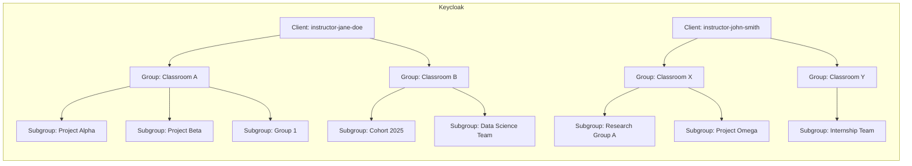

# Using Keycloak for CKAN Access Control in the National Data Platform (NDP)

## Overview

This document explains why Keycloak is a preferred choice for managing data access in CKAN and outlines how its **client**, **group**, and **subgroup** structure can be effectively leveraged in the **National Data Platform (NDP)** for managing **classrooms**, **projects**, and **challenges**.

---

## 1. Why Use Keycloak with CKAN?

### ✅ Centralized Identity and Access Management

* Keycloak provides a **central login system** for all services: CKAN, FastAPI, JupyterHub, etc.
* Eliminates redundant user management in CKAN.
* Makes it easy to manage users and roles across multiple systems.

### 🔐 Secure Authentication & Authorization

* Supports **OAuth2 and OpenID Connect** protocols.
* Enables **token-based API access** with permission scopes.
* Enforces **multi-factor authentication (MFA)** and **password policies**.

### 🧐 Fine-Grained Role Mapping

* Role-based access control (RBAC) can be defined outside CKAN and synced via groups/roles.
* Example: `ckan-editor`, `ckan-viewer`, `ckan-admin` roles assigned through Keycloak groups.

### 🔄 SSO and Federated Identity

* Single Sign-On for all users.
* Easy integration with institutional login (SAML) or social providers (Google, GitHub).

---

## 2. Keycloak Structure in NDP: Clients, Groups, Subgroups, and Users

To clearly understand how Keycloak is structured and used in the NDP, let’s define each entity precisely:

### 🔑 Client

* A **client** in Keycloak represents a single application or access context.
* Each CKAN deployment (e.g., for an instructor) is typically mapped to a unique client.
* Clients manage their own login flows, secrets, redirect URIs, and associated roles.

**Think of a client as an app container with isolated access settings.**

### 👥 Group

* A **group** is a collection of users under a client.
* Groups often represent **classrooms**, **teams**, or **cohorts**.
* Roles can be assigned to groups so all users within inherit those roles.

**Think of groups as logical user cohorts within a client.**

### 📂 Subgroup

* A **subgroup** is a child group nested within a group.
* They help organize users further (e.g., projects within a classroom).
* Subgroups inherit roles from parent groups, but not the other way around.

**Subgroups enable finer-grained team structures under a group.**

### 🙋 User

* A **user** is an individual who logs in and is assigned to one or more groups/subgroups.
* Users inherit roles from all groups and subgroups they belong to.

**Users gain access and permissions through group membership.**

#### Example Hierarchy

```
Client: instructor-jane-doe
├── Group: Classroom A (ckan-editor)
│   ├── Subgroup: Project Alpha
│   └── Subgroup: Project Beta (ckan-publisher)
└── Group: Classroom B (ckan-viewer)
    └── Subgroup: Data Science Team
```

* A user in `Project Alpha` inherits `ckan-editor` from `Classroom A`.
* A user in `Project Beta` inherits both `ckan-editor` and `ckan-publisher`.

---

## 3. Realm Roles vs. Client Roles in Keycloak

### ✨ Realm Roles

* Defined at the **realm level**.
* Apply globally across all clients.
* Useful for roles like `realm-admin`, `ndp-global-admin`, or custom high-level access.

### 🔐 Client Roles

* Scoped to a **specific client**.
* Used for app-specific access control, like `ckan-editor`, `ckan-viewer`.
* Not visible to other clients unless explicitly mapped.

### Role Assignments

* Roles can be assigned **directly to users** or to **groups**.
* If a role is given to a **group**, all users in that group automatically receive the role.

### Inheritance in Groups and Subgroups

* Subgroups **inherit** roles from their parent group.
* Parent groups **do not inherit** roles from their subgroups.

#### Example:

```
Group: teachers
├── Subgroup: math-teachers
    └── User: alice
```

* If `teachers` has role `ckan-editor`, **Alice** will get it.
* If only `math-teachers` has it, `teachers` and other subgroups **won't**.

---

## 4. Why Not Use One Client with Many Groups?

| Criteria               | Multiple Clients         | One Client with Groups |
| ---------------------- | ------------------------ | ---------------------- |
| Token Isolation        | ✅ Yes                    | ❌ No                   |
| Environment Separation | ✅ Easy                   | ❌ Complex              |
| Auditability           | ✅ Per client             | ❌ Hard to filter       |
| Configuration Overhead | ❌ More clients to manage | ✅ Simpler (initially)  |
| Security Granularity   | ✅ Scoped per use-case    | ❌ Shared tokens/roles  |

### Risks of Single-Client Design:

* Risk of **role misconfiguration** or **privilege escalation**.
* Difficult to support **multiple redirect URIs** cleanly.
* Harder to enforce per-client API rate limits and access logs.

---

## 5. Example Diagram



---

## 6. Example Role Mappings

### Keycloak Group to CKAN Role Mapping

| Keycloak Group      | CKAN Role          |
| ------------------- | ------------------ |
| instructors         | admin              |
| teaching-assistants | editor             |
| students            | member             |
| guest-students      | reader (read-only) |

CKAN API example (run as sysadmin or with elevated token):

```python
import ckanapi

ckan = ckanapi.RemoteCKAN('https://your-ckan-instance/api/3', apikey='your-sysadmin-api-key')

ckan.action.member_create(
    id='ndp-classroom-a',
    object='user123',
    object_type='user',
    capacity='editor'  # based on role from Keycloak group
)
```

---

## 7. CLI/Script Automation (Pseudocode Workflows)

### 🔁 Sync Keycloak Group Memberships to CKAN Roles

1. List all clients in Keycloak.
2. For each client, get users and their group memberships.
3. For each user:

   * Map group to CKAN role.
   * Use CKAN API to add user to relevant org with mapped role.

**Pseudocode:**

```bash
for client in $(keycloak list clients); do
    for user in $(keycloak get users --client $client); do
        group=$(keycloak get user-groups --user $user)
        ckan_role=$(map_group_to_ckan_role $group)
        call_ckan_api_to_add_user user $ckan_role $client
    done
done
```

### 🛠 Tools for Automation

* [kcadm.sh](https://www.keycloak.org/docs/latest/server_admin/#admin-cli) (Keycloak CLI tool)
* Python SDKs: `python-keycloak`, `ckanapi`
* Cronjobs or GitHub Actions for syncing periodically

---

## 8. Next Steps

### 🧱 Define a Client and Group Template

* Create a JSON/Realm template with:

  * Client: `instructor-*`
  * Groups: `classroom-a`, `classroom-b`, etc.
  * Mapped roles: `ckan-viewer`, `ckan-editor`, `ckan-admin`

### ⚙️ Automate Client & Group Provisioning

* Use `kcadm.sh` to create clients and groups automatically from input YAML or JSON.

```bash
kcadm.sh create clients -r NDP -f client-template.json
kcadm.sh create groups -r NDP -s name=students -s realmRoles=ckan-viewer
```

### 🔁 Automate CKAN Role Assignments

* Write a Python script that:

  * Authenticates with Keycloak.
  * Fetches users & groups.
  * Calls CKAN API to assign users to orgs with correct roles.

### 🔄 Sync in CI/CD Pipeline

* Add GitHub Actions or GitLab CI to:

  * Apply Keycloak realm configuration from repo.
  * Validate client/group existence.
  * Trigger CKAN sync post-deploy.

### 🔍 Audit Token Scopes

* Periodically list all issued tokens.
* Check for expired or unused scopes.
* Revoke old tokens or misconfigured access.

---

## 9. Keycloak Design Clarifications (Extended)

### 🔍 Client Searchability

* `client_id` values are globally unique in a realm.
* Searchable via Admin UI, REST API, or CLI:

  ```bash
  kcadm.sh get clients -r NDP -q clientId=instructor-jane-doe
  ```
* Easier to query and filter than deeply nested group structures.

### ⚖️ Native vs. Custom Functionality

* Most client-side operations (token issuance, redirect URIs, roles, scopes) are **native**.
* Customizations mostly apply to provisioning and CKAN syncing.
* Audit logging is minimal by default and requires enabling external listeners or logs.

### 🔒 Security and Escalation Risk

* Using multiple clients **contains the blast radius** if a client secret is compromised.
* A single global client with high-scoped secrets is a much greater risk.

### 🌲 Client vs. Group Search

* Clients are a **flat structure**, groups are **tree-based**.
* Group-based search requires **recursive traversal** and **role inheritance resolution**.
* Flat clients are easier to audit, manage, and search by name prefix or tags.
